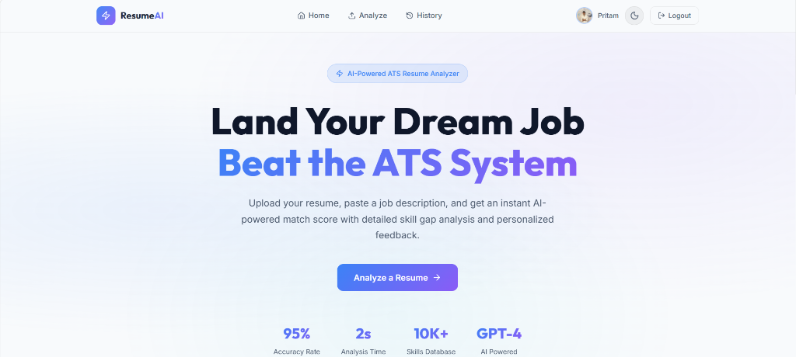
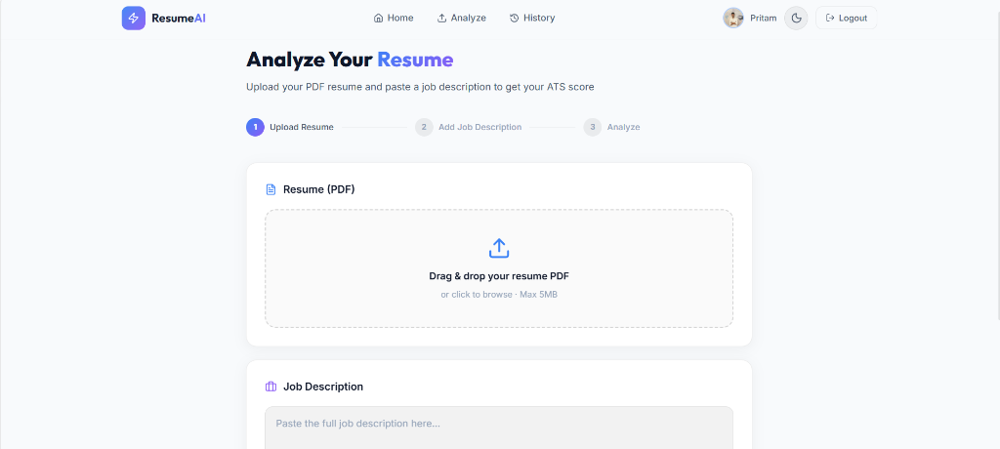
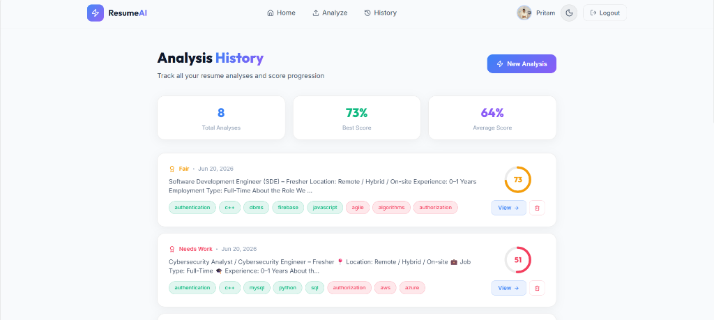
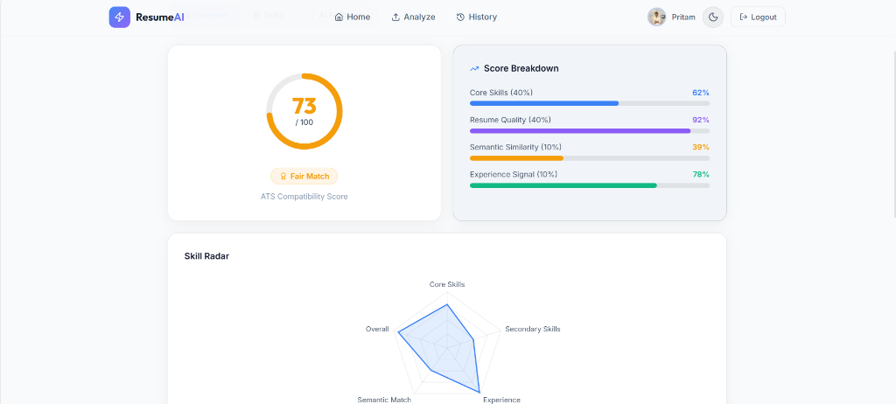
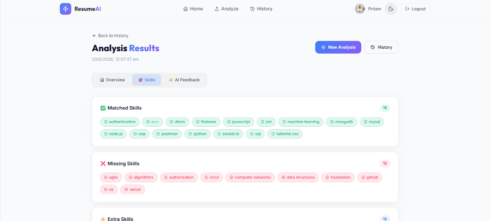
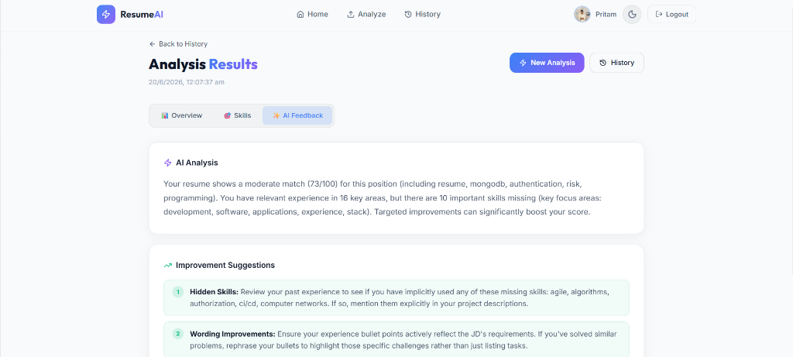

# 🚀 ResumeAI – AI-Powered Resume Score Analyzer

AI-powered ATS simulator that compares resumes against job descriptions, generates a match score, detects skill gaps, and provides LLM-generated feedback.

## 📸 Screenshots

### Home


### Analyze


### History


### Score Breakdown


### Skill Gap


### AI Feedback


## 🗂️ Project Structure

```
Resume Analyzer/
├── frontend/          # React + Vite + Tailwind CSS
├── backend/           # Node.js + Express (API Gateway)
└── ml-service/        # Python + Flask (ML/NLP Engine)
```

## ⚙️ Tech Stack
- **Frontend**: React, Vite, Tailwind CSS, Firebase Auth
- **Backend**: Node.js, Express, MongoDB, Firebase Admin
- **ML Service**: Flask, pdfplumber, sentence-transformers, scikit-learn
- **AI Layer**: Google Gemini / OpenAI GPT

---

## 🚀 Quick Start

### 1️⃣ Firebase Setup (Required)

1. Go to [Firebase Console](https://console.firebase.google.com/)
2. Create a new project
3. Enable **Google Authentication** (Authentication → Sign-in methods → Google)
4. Get **Web App config** (Project Settings → Your Apps)
5. Generate **Service Account key** (Project Settings → Service Accounts → Generate new private key)

---

### 2️⃣ Frontend Setup

```bash
cd frontend
cp .env.example .env
# Fill in your Firebase Web App config values
npm install
npm run dev
```

---

### 3️⃣ Backend Setup

```bash
cd backend
cp .env.example .env
# Fill in:
#   MONGODB_URI (local or Atlas)
#   FIREBASE_PROJECT_ID, FIREBASE_PRIVATE_KEY, FIREBASE_CLIENT_EMAIL
#   ML_SERVICE_URL=http://localhost:8000
npm install
npm run dev
```

---

### 4️⃣ ML Service Setup

```bash
cd ml-service
cp .env.example .env
# Add GOOGLE_GEMINI_API_KEY or OPENAI_API_KEY

# Windows:
python -m venv venv
venv\Scripts\activate

# Mac/Linux:
python3 -m venv venv
source venv/bin/activate

pip install -r requirements.txt
python app.py
```

> **Note**: First run downloads the `all-MiniLM-L6-v2` model (~90MB). This is automatic.

---

## 🌐 Ports
| Service     | Port |
|-------------|------|
| Frontend    | 3000 |
| Backend     | 5000 |
| ML Service  | 8000 |

---

## 🧠 How It Works

1. User uploads PDF resume + pastes job description
2. Backend forwards to ML service
3. ML service:
   - Extracts text (pdfplumber)
   - Extracts skills (skills database)
   - Computes semantic similarity (sentence-transformers)
   - Calculates weighted score: `(Core×0.4) + (Quality×0.4) + (Semantic×0.1) + (Experience×0.1)`
   - Gets AI feedback (Gemini/OpenAI)
4. Result saved to MongoDB
5. Frontend shows score, skill breakdown, radar chart, AI feedback

## 🔐 Auth Flow
- Google OAuth via Firebase
- Frontend gets Firebase ID token
- Sent to backend via `Authorization: Bearer <token>`
- Backend verifies with Firebase Admin SDK
- All analysis routes require valid token

## 📊 API Endpoints
| Method | Endpoint | Description |
|--------|----------|-------------|
| POST | `/api/analyze` | Upload resume + JD |
| GET | `/api/result/:id` | Get analysis result |
| DELETE | `/api/result/:id` | Delete analysis |
| GET | `/api/history` | Get user history |
